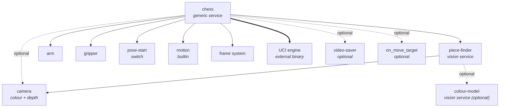
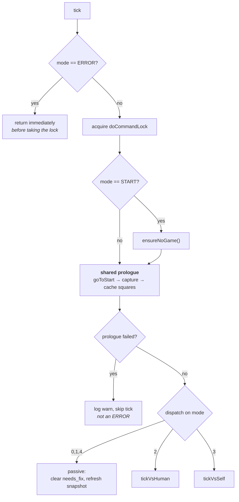
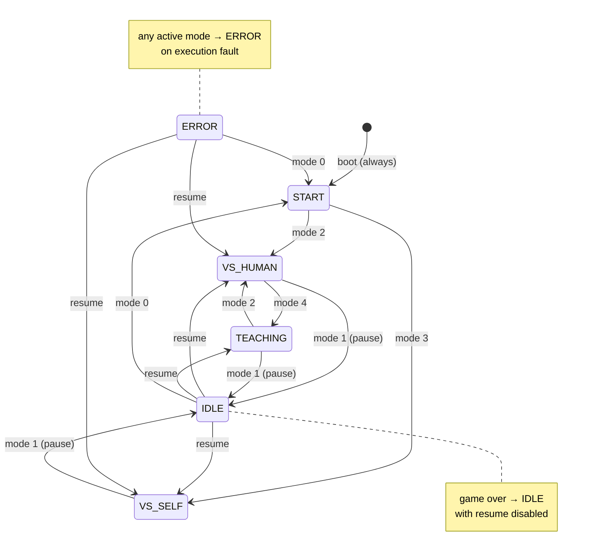
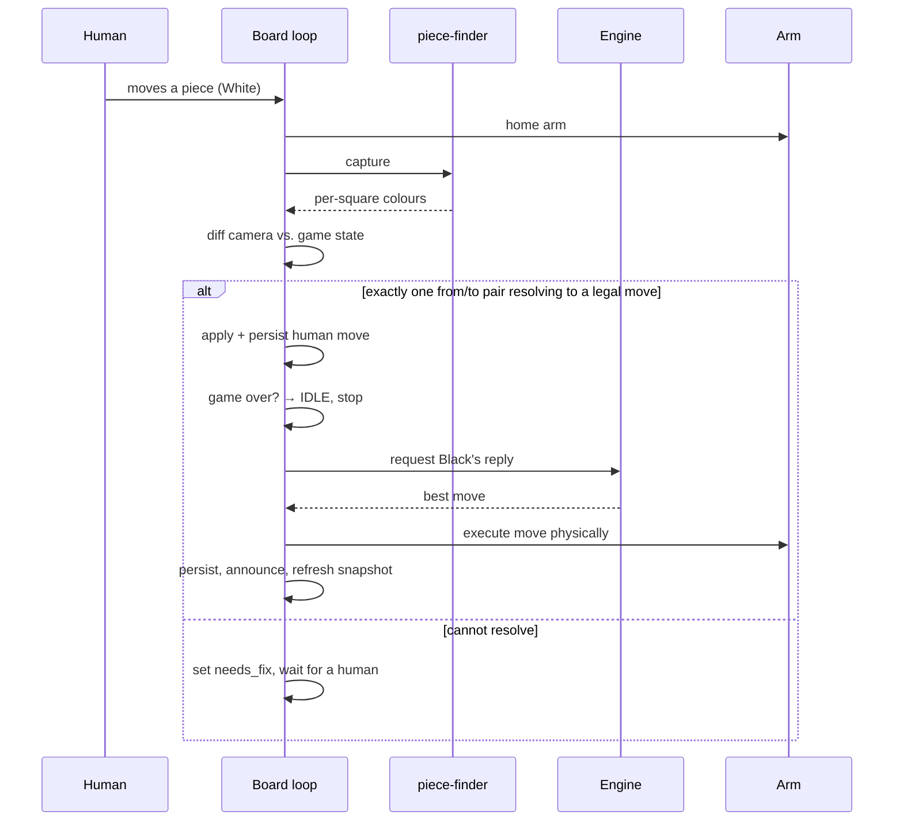

# viam-chess Operations Playbook

**How the module and the robot are expected to operate.**

This is the behavioural contract for the `erh:viam-chess` module and the machine
it runs on. The [README](../README.md) documents *what the module is* and how to
configure it; this playbook documents *how it behaves at runtime* — the modes it
occupies, what happens on every tick, which failures are benign and which halt
the robot, and what an operator should see and do.

Part 1 is the **operator runbook** (no Viam knowledge assumed). Part 2 is the
**engineer reference** (design-level detail, invariants, and the config
contract). [Appendix A](#appendix-a--code-cross-reference) maps the `§N.N`
markers cited in the Go source to the sections here.

---

## Contents

**Part 1 — Operator runbook**
1. [System at a glance](#1-system-at-a-glance)
2. [The six modes](#2-the-six-modes)
3. [A normal session](#3-a-normal-session)
4. [What "healthy" looks like](#4-what-healthy-looks-like)
5. [Recovery](#5-recovery)

**Part 2 — Engineer reference**

6. [Resource topology](#6-resource-topology)
7. [The board loop](#7-the-board-loop)
8. [Mode machine](#8-mode-machine)
9. [The turn cycle](#9-the-turn-cycle)
10. [Perception pipeline](#10-perception-pipeline)
11. [Physical geometry](#11-physical-geometry-graveyard-promotion-pickup)
12. [Error taxonomy](#12-error-taxonomy)
13. [Persistence and lifecycle](#13-persistence-and-lifecycle)
14. [Configuration contract](#14-configuration-contract)
15. [Command reference by intent](#15-command-reference-by-intent)
16. [Design limits](#16-design-limits-working-as-intended)

[Appendix A — Code cross-reference](#appendix-a--code-cross-reference)

---
---

# Part 1 — Operator runbook

## 1. System at a glance

A camera on the arm looks down at a chessboard. Roughly once a second the robot
homes the arm out of the way, takes a picture, and works out which squares hold
a piece and what colour it is. When it's the robot's turn, Stockfish picks a
move and the arm physically plays it.

```
        ┌──────────── every ~1 second ────────────┐
        │                                          │
   home the arm  →  capture  →  read the board  →  decide  →  (maybe) move a piece
   (clears the                 (per-square:        (mode      (arm + gripper)
    camera view)                empty/white/black)  decides)
        │                                          │
        └──────────────────────────────────────────┘
```

Two things are worth internalising, because most confusing behaviour traces back
to them:

- **The robot only ever sees colours, not piece types.** Perception reports
  "square e4 holds a white piece" — never "a white knight". Piece identity comes
  entirely from the *game state the robot has been tracking*, not from the
  camera. This is why a scrambled board cannot be recovered from by looking at it.
- **The robot plays Black. Always.** In a human game the human is White and moves
  first. The robot never plays White.

## 2. The six modes

At any moment the robot is in exactly one mode, and that mode fully determines
what it will do. The Stream Deck page mirrors the current mode.

| # | Mode | What the robot is doing | Will it move a piece? |
|---|------|-------------------------|----------------------|
| 0 | **START** | No game. Entry hub — waiting for you to choose an opponent. | No |
| 1 | **IDLE** | A game exists but is suspended (paused) or finished. | No |
| 2 | **VS_HUMAN** | Watching for your move, then replying as Black. | Yes |
| 3 | **VS_SELF** | Playing itself, one half-move per tick. | Yes |
| 4 | **TEACHING** | Game preserved, robot passive. *Stub — no behaviour yet.* | No |
| 5 | **ERROR** | Something physical failed. Loop halted, arm homed. | No |

Modes 0, 1, 4 and 5 are **passive**: the robot keeps watching and keeps its
board display up to date, but it will never touch a piece. Only modes 2 and 3
move the arm during play.

> **START means "no game".** Entering START discards any saved game. Choosing an
> opponent from START always begins a brand-new game from the standard opening
> position — and it *assumes you have already set the physical board up
> correctly*. The robot does not verify this before it starts.

## 3. A normal session

### Starting a game against a human

1. **Set the board up** in the standard starting position, and place a **spare
   queen in slot 0 of each colour's graveyard** (see
   [§11](#11-physical-geometry-graveyard-promotion-pickup)) — that's what
   promotion uses.
2. Confirm the robot is in **START**.
3. Press **Human vs. Machine** → mode 2 (VS_HUMAN).
4. **You move first, as White.** Make your move on the physical board and take
   your hand away.
5. Within a second or two the robot registers your move, then reaches in and
   plays Black's reply.
6. Repeat. Pause any time with **pause** → mode 1 (IDLE).

### Starting self-play

Press **Machine vs. Machine** → mode 3 (VS_SELF). The robot verifies the board
on the very first half-move only, then plays both sides *blind* — it trusts its
own arm and stops checking the camera against the game. One half-move per tick.

### Pausing and resuming

**pause** parks the robot in IDLE and preserves the game. The Stream Deck's IDLE
page then offers **Resume game** (returns to the mode you paused from) or **New
game** (leads to the reset choices).

Pause is acknowledged **instantly**, but if the arm is mid-move that move
completes first. The robot stops *before the next* half-move, not mid-reach.
This is deliberate — aborting mid-reach would drop a piece.

### Ending a game

When the game ends (checkmate, stalemate, or a draw), the robot parks itself in
IDLE automatically and **Resume is disabled** — a finished game cannot be
resumed. Your options are a manual reset or a machine reset.

### Resetting

Two different things, both reached from the "New game" page:

| Button | What it does | When to use it |
|--------|--------------|----------------|
| **Reset manually (press when done)** | Software only (`mode 0`). Discards the game and returns to START. **You** rearrange the pieces. | Normal case, and always after an ERROR. Fast and safe. |
| **Machine reset (press and watch!)** | The arm physically rearranges every piece back to its home square, retrieving captured pieces from the graveyard and restoring the spare queen. | When you want the robot to do the work — but stay and watch it. |

Machine reset is a long sequence of arm moves. Watch it. It is **blocked in
ERROR mode** by design, because the arm may be in an unsafe state.

## 4. What "healthy" looks like

| Signal | Healthy |
|--------|---------|
| Arm at rest | Returns to the same home pose between every action; gripper open |
| Cadence | Board re-read about once a second |
| Board display | Matches the physical board, and is stable — squares are not flickering between empty/white/black |
| Piece count | 32 at game start, decreasing only when a capture actually happened |
| Mode | Matches what you expect; the Stream Deck page tracks it |
| `needs_fix` | Clear during normal play |

**`needs_fix` is the robot's "I'm confused, a human should look" signal.** It is
set when the board it sees cannot be reconciled with the game it is tracking —
an illegal position, pieces knocked over, a piece mid-air when the shutter
fired, or a move it can't interpret. It is **not** an error and does not stop
the robot; it just means the robot is waiting for the board to make sense again.
It clears itself as soon as it does.

## 5. Recovery

### The robot is confused about the position (`needs_fix`)

The robot is waiting for you. Put the pieces back where the *game* says they
should be — the board display shows the position it is tracking. Once the
physical board matches, `needs_fix` clears on the next tick and play resumes.

If you can't reconcile it, abandon the game: **mode 0** (manual reset) → set up
a fresh board → choose an opponent again.

### The robot has stopped and shows ERROR

ERROR means a **physical execution fault** — the arm couldn't reach a pose, the
gripper failed to grab after two attempts, or the chess engine died. The robot
has halted the loop and homed the arm. It will not move again until you act.
The saved game is preserved.

1. **Look at the robot first.** Clear any obstruction; check whether a piece was
   dropped or is still in the gripper; check the arm isn't in a strange pose.
2. **Restore the board** to match the position shown on the display.
3. Then either:
   - **Resume** — returns to the mode you were in, but only if the saved game is
     still intact. Use when the fault was transient and the board is correct.
   - **mode 0** — abandon the game, return to START, set up fresh. Use when in
     any doubt. This is always safe.
4. Do **not** attempt a machine reset from ERROR; it is deliberately blocked.

### The robot moved a piece to the wrong place

Physically correct it, then decide:
- Position is otherwise sound → the robot will re-read the board and continue.
- Game state is now untrustworthy → **mode 0** and start over.

### Common physical causes

| Symptom | Likely cause |
|---------|--------------|
| Repeated grab failures at one square | Board shifted; piece not centred; wrong pickup height for that piece |
| Colours flickering on the display | Lighting — ambient change, shadow, or glare. Cream pieces read near the black/white cutoff |
| Squares flickering empty/occupied | Piece height near the presence threshold, or depth/colour frames disagreeing |
| Everything mislocated after a knock | Board moved. The robot caches square positions — clear that cache (`clear-cache`) so it re-measures |

> **If the board is ever physically moved or bumped, clear the square cache.**
> The robot measures each square's real-world position once and reuses it. After
> a knock those coordinates are stale and every subsequent reach will be off.

---
---

# Part 2 — Engineer reference

## 6. Resource topology

The `chess` generic service is the orchestrator. Its dependencies:



**Required** (`chess` fails to build without them): `piece-finder`, `arm`,
`gripper`, `pose-start`, and the builtin `motion` service.

**Optional** (missing → logged warning, feature silently disabled, service still
builds): `camera` (only needed for `capture-dir`), `video-saver`,
`on_move_target`.

`on_move_target` is optional **by necessity, not convenience**: the typical
target (an AI responder) depends on `chess` for game context, so a hard
dependency would deadlock the resource graph. Because the service is
`AlwaysRebuild`, once the target becomes available the constructor re-runs and
the dependency resolves without intervention.

> Optional dependencies fail **quietly**. A typo in `video-saver` or
> `on_move_target` produces one warning at build time and then permanent silent
> inactivity. Verify by name against the machine config, not by expecting an error.

## 7. The board loop

A single background goroutine, started in the constructor, driving everything.
Cadence is `board-loop-interval-ms`; **`0` disables the loop entirely**, in
which case `board-snapshot` degrades to a per-call camera capture and no
autonomous play happens at all.

Each tick:



Four properties matter for reliability:

1. **ERROR returns before acquiring the lock.** This is what keeps manual
   recovery commands responsive while halted.
2. **The mode is read once, at tick start.** A mode change mid-tick takes effect
   on the *next* tick; the in-flight arm motion finishes first. This is the
   mechanism behind "pause acks instantly, the current move completes".
3. **The prologue homes the arm every tick, in every non-ERROR mode.** Homing
   is what clears the arm from the camera's field of view. It is not conditional
   on there being a game — a passive robot still commands the arm and opens the
   gripper on every tick.
4. **A prologue failure is transient, not a fault.** A failed home or capture
   logs a warning and forfeits the tick. It does not enter ERROR. Persistent
   prologue failure therefore presents as a robot that looks alive but never
   progresses — check the logs, not the mode.

The loop holds `doCommandLock` for the whole tick, including any arm motion.
`board-snapshot`, `{"mode":N}`, `{"auto":bool}` and `mode-status` all bypass
this lock so that polling clients and the pause control stay responsive during a
multi-second arm move.

## 8. Mode machine

`mode.go` holds the authoritative transition table. Everything is guarded by one
`RWMutex`, so transitions are atomic.



### Correlated state

Three fields travel with the mode, and the distinction between them is
load-bearing:

| Field | Meaning |
|-------|---------|
| `idleOrigin` | Which mode IDLE resumes to. Set on entering IDLE. |
| `errPrevMode` | Which mode ERROR resumes to. Set on entering ERROR. |
| `gameOver` | Set when a game *ends* into IDLE. Permanently disables resume. |

`idleOrigin` and `errPrevMode` are deliberately **separate** rather than one
shared "previous mode". A fault while paused traces
`IDLE → ERROR → resume → IDLE`, and IDLE must still remember its own origin.

### Command vs. automatic edges

- **Command-driven** edges go through `transition(to)` and are validated against
  the table. An illegal edge is rejected and the mode is unchanged.
- **Automatic** edges bypass the table: `enterIdle` (game over), `enterError`
  (execution fault, idempotent), `enterStart` (after a physical reset — allowed
  from any non-ERROR mode, since rearranging pieces necessarily ends the game).

### Transitions are lock-free

`{"mode":N}` never takes `doCommandLock`. It flips in-memory state and returns.
All physical and persistent consequences land on the next tick. Two exceptions
run inline because they must not race:

- **START → active** wipes the saved game immediately. START has no concurrent
  state writer, so this is safe — and doing it inline closes the window where a
  leftover game from a previous boot could be picked up.
- **Resuming from ERROR** (to anything but START) first verifies the saved game
  is readable, and refuses if not.

### The `auto` compatibility shim

`{"auto":bool}` is the pre-mode-machine API and is still emitted by the
companion UI. It maps onto transitions: `auto:true` starts or resumes VS_HUMAN;
`auto:false` from VS_HUMAN pauses to IDLE; `auto:false` elsewhere is a no-op.
Every response still reports `auto` (defined as `mode == VS_HUMAN`) alongside
the newer `mode` field, so unmodified clients keep working.

Every successful `DoCommand` response carries the current `mode`.

## 9. The turn cycle

### VS_HUMAN



Detection works by diffing the camera's per-square colour against the tracked
game position:

- **0 differences** → nothing happened. No reply.
- **2 differences** (one emptied, one now occupied) → a candidate move, matched
  against the legal move list.
- **4 differences** matching a known castling pattern → resolved as that castle.
- **Anything else** → vision noise or a genuinely broken position. The capture is
  retried up to `bad-diff-max-attempts` times at 200 ms intervals. If it never
  settles, the error surfaces and sets `needs_fix`.

Two subtleties worth knowing:

- **Mid-castle is deliberately deferred.** A human who has moved the king but not
  yet the rook presents exactly 2 differences that look like a legal castle. The
  code detects this pattern and *waits*, rather than committing the move and
  racing the human to the rook.
- **Game-over is checked before replying**, so a human-delivered mate never
  triggers a doomed engine reply.

The robot replies only when a human move was registered on *this* tick and it is
Black's turn.

### VS_SELF

One half-move per tick, alternating colours. The board is verified on the **first
half-move only** (reusing the same sanity check `{"go":N}` performs); after that
it plays blind and trusts the arm. A non-execution failure on that first
half-move means the board isn't set up yet — it sets `needs_fix` and waits
rather than faulting. Once the game ends it parks in IDLE; it never auto-restarts.

## 10. Perception pipeline

`piece-finder` consumes one colour+depth camera frame and emits one object per
square, labelled **`<square>-<colour>`** where colour is `0` empty, `1` white,
`2` black. That label string is the entire interface between perception and
gameplay.

```
camera (colour + depth)
   └─ find the board, derive 64 square regions
        └─ shrink each square by square-inset px      (avoid border lines, RGB/depth misalignment)
             └─ take points above the board surface   (min-piece-size mm → the "top band")
                  ├─ presence:  2D Otsu separation ≥ otsu-separation-threshold
                  │             AND top-band footprint ≥ min-top-footprint-mm
                  │             AND colour divergence ≤ color-divergence-guard
                  └─ colour:    mean RGB vs. brightness-threshold  (below → black, above → white)
                       └─ optional: colour-model ML detections override the heuristic
                            └─ label "<square>-<0|1|2>"
```

**Only colour is reported, never piece type.** Piece identity is supplied
entirely by the tracked game state. Everywhere the code needs a piece type
without a reliable game state — undo, reset, graveyard pickups — it replays move
history or passes an explicit override rather than asking the camera.

### Thresholds that decide stability

Two knobs dominate frame-to-frame stability, and both live on **`piece-finder`**:

- **`brightness-threshold`** (default `128`) — the mean-RGB cutoff between black
  and white. Real chess sets are usually cream/ivory rather than pure white and
  average roughly 115–135 under typical lighting, which puts the default cutoff
  *right where borderline pieces flip between frames*. Lower it (e.g. `110`) if
  light pieces classify as black; raise it if shadows on dark pieces classify as
  white.
- **`min-piece-size`** (default `25` mm) — how far above the board surface points
  must sit to count as a piece. Too low picks up board texture and shadow; too
  high loses short pieces.

Instability in either shows up the same way to an operator: squares flickering
on the board display. The distinction is *what* flickers — colour flapping
(`1`↔`2`) points at `brightness-threshold`; presence flapping (`0`↔`1`/`2`)
points at `min-piece-size` and the presence guards.

### Square position cache

Square → real-world XY is measured from the point cloud once and cached (target:
all 64). Once warm, the arm can move source-to-source without homing first,
which is a meaningful speed-up. The cache is cleared on `wipe`, `clear-cache`,
reset, and after undo.

> The cache is **not** invalidated by the board physically moving — the robot
> has no way to detect that. Clearing it after any knock is a manual
> responsibility, and stale coordinates are a leading cause of grab failures.

## 11. Physical geometry (graveyard, promotion, pickup)

### Graveyard

Captured pieces go to rows running off the board edge — White's alongside the
a-file (negative Y), Black's alongside the h-file (positive Y). Slot *n* is
derived from the corresponding edge square's cached position, stepped out by
`graveyard-spacing-y` per row (8 slots per row). Slots are addressed as
`XW<n>` / `XB<n>`.

**Slot 0 of each colour is reserved for a spare queen** and is never used by
normal play — captures fill slots 1, 2, 3….

### Promotion

Auto-queen, and it never places the pawn on the promotion square. Sequence:

1. If the promotion captures, evict the captured piece to the opposing graveyard.
2. Move the promoting pawn **directly from rank 7/2 into the next free graveyard
   slot of its own colour**.
3. Pick up the spare queen from slot 0 and place it on the promotion square.

When a *human* promotes, they perform the physical swap themselves; the robot
records the vanished pawn so reset and snapshots stay consistent.

Reset restores the spare queen to slot 0 automatically. **One promotion per
colour per game** — slot 0 holds a single spare. Undo through a promotion is
rejected.

### Pickup heights and clearance

| Situation | Height |
|-----------|--------|
| Short pieces (pawn, rook, bishop, knight) | `grab-z` (default 40 mm) |
| Tall pieces (king, queen) | `grab-z-tall` (default 80 mm) |
| Graveyard slots | `graveyard-z` (default 60 mm) |
| Transit between squares | `safeZ` = 200 mm |

Height is normally inferred from the piece type on the tracked board. When the
source isn't a board square — a graveyard slot during undo or reset — an
explicit override is passed instead, because inference would silently fall back
to the short-piece height and a captured queen would be grabbed at the wrong
height.

**Wrist clearance:** when reaching into ranks 5–8 *and* an adjacent square on
the same rank holds a king or queen, the wrist rotates by a fixed 25° offset so
the gripper clears the tall neighbour.

**Grab verification:** a grab is confirmed by reading the gripper position back
from the arm — the gripper reporting success is not trusted on its own. A failed
grab is retried once, offset +20 mm in X. A second failure is an execution fault.

## 12. Error taxonomy

The single most important reliability distinction in the codebase: **only
execution faults halt the robot.**

Faults are classified by *identity*, not call site. `errExec()` wraps an error as
an `execError` at the lowest level (arm, gripper, motion, engine); anything that
propagates a wrapped `execError` is an execution fault.

| Class | Examples | Consequence |
|-------|----------|-------------|
| **Execution fault** | Motion planning failure; `goToStart` failure during a move; gripper grab failure after 2 attempts; engine crash | → **ERROR**. Loop halts, arm homed best-effort, `state.json` preserved |
| **Detection failure** | Board can't be mapped to a legal move; unresolvable difference count; illegal/scrambled position | → **`needs_fix`**. Robot waits for a human. Not an error |
| **Transient** | Prologue home or capture failure | → warning, tick skipped. No state change |
| **Invalid input** | Bad command payload, illegal mode transition | → error returned to caller. No state change |

Consequences of classifying by identity rather than call site:

- An illegal-board error raised inside a manual `{"go":N}` correctly does **not**
  trip ERROR — it's a detection problem, not a hardware fault.
- The board loop and the manual command path make the same decision from the
  same information, so behaviour doesn't depend on how a move was triggered.

`goToStart` failures are the one asymmetry: as part of the *tick prologue* they
are transient (skip the tick), but the same failure *during a move* is an
execution fault, because a move that can't home cannot safely continue.

## 13. Persistence and lifecycle

### State file

`$VIAM_MODULE_DATA/state.json`:

```json
{
  "fen": "...",
  "moves": ["e2e4", "e7e5"],
  "white_graveyard": [...],
  "black_graveyard": [...]
}
```

`moves` is authoritative — the game is reconstructed by replaying it from the
opening position, which is what makes undo, capture attribution, and graveyard
reconstruction possible. `fen` alone is a legacy fallback that loads but
supports no undo.

**File presence is the definition of "a game exists".** START enforces its
absence idempotently on every tick and inline on the way out.

### Boot sequence

1. Resolve dependencies (optional ones warn and disable on failure).
2. **`goToStart` — the constructor fails if the arm cannot home.** Startup is
   gated on a working arm.
3. Locate `state.json`, launch the UCI engine.
4. Start the board loop.
5. Initialise the engine and apply the configured Elo.

**The robot always boots into START**, regardless of any game left on disk.
There is no mid-game crash recovery, by design: after an unplanned restart the
physical board state is unknown, so resuming would be a guess.

### Engine strength

Elo is applied via UCI `UCI_LimitStrength` / `UCI_Elo`, clamped to the range the
engine reports, with a warning when clamped. The applied value is returned.
`engine-millis` (default 10 ms) caps per-move search time and bounds how long an
engine turn can stall the loop.

### Move announcements

After every move, `chess` fires a `move_made` event at `on_move_target`:

```json
{"event": "move_made", "move": "<UCI>", "fen": "<post-move FEN>", "by": "engine|human"}
```

Fire-and-forget: a separate goroutine with its own 30-second timeout, so a slow
or broken downstream can never delay a chess move. Failures are logged only.
Toggle at runtime with `set-announce`.

## 14. Configuration contract

### `chess` (generic service)

**Required:** `piece-finder`, `arm`, `gripper`, `pose-start`.

| Field | Default | Notes |
|-------|---------|-------|
| `camera` | — | Required only when `capture-dir` is set |
| `video-saver` | — | Optional; missing → silently disabled |
| `on_move_target` | — | Optional; missing → silently disabled |
| `engine` | `stockfish` | Path to the UCI binary |
| `engine-millis` | `10` | Per-move search time |
| `elo` | `1500` | Clamped to the engine's range |
| `capture-dir` | — | Needs `camera` |
| `grab-z` | `40.0` | mm — short pieces |
| `grab-z-tall` | `80.0` | mm — king/queen |
| `graveyard-z` | `60.0` | mm |
| `graveyard-spacing-y` | `80.0` | mm between graveyard rows |
| `gripper-open-pos` | `450.0` | Servo units |
| `bad-diff-max-attempts` | `10` | Recapture retries on noisy diffs |
| `board-loop-interval-ms` | `0` (**disabled**) | Loop cadence. Must be set for autonomous play |
| `companion-bad-state-delay-ms` | `60000` | UI hint timing |
| `companion-welcome-revive-ms` | `60000` | UI hint timing |
| `companion-in-check-dismiss-ms` | `8000` | UI hint timing |
| `companion-first-move-dismiss-ms` | `8000` | UI hint timing |

### `piece-finder` (vision service)

**Required:** `input` (a camera cropped to the board).

| Field | Default | Notes |
|-------|---------|-------|
| `min-piece-size` | `25.0` | mm above board surface |
| `brightness-threshold` | `128.0` | Mean RGB; black/white cutoff |
| `square-inset` | `10.0` | px shrink per side |
| `otsu-separation-threshold` | `25.0` | Presence sensitivity |
| `color-divergence-guard` | `60.0` | Rejects the 3D verdict when point-cloud and image colours disagree |
| `min-top-footprint-mm` | `5.0` | Minimum top-band extent |
| `color-model` | — | Optional ML vision service; overrides heuristic colour |
| `crop-origin-x` / `-y` | `0` | Only if the ML model expects full-image coordinates |

> ### Unknown configuration keys are silently ignored
>
> Viam config parsing drops unrecognised fields without error. A tuning key
> placed on the **wrong service**, or a **misspelled** key, produces no warning
> — the resource builds cleanly and runs on defaults.
>
> The detection-tuning knobs (`min-piece-size`, `brightness-threshold`,
> `square-inset`, `otsu-separation-threshold`, `color-divergence-guard`,
> `min-top-footprint-mm`) belong on **`piece-finder`**, not on `chess`. Placing
> them on `chess` has no effect whatsoever.
>
> After changing any tuning value, **verify it took effect** by observing
> behaviour (e.g. sample `board-snapshot` repeatedly and check stability) rather
> than assuming the config was accepted.

## 15. Command reference by intent

Full payload details are in the [README](../README.md#command-reference). Grouped
by what you're trying to do:

| Intent | Command | Notes |
|--------|---------|-------|
| Change mode | `{"mode": 0-5}` | Validated; lock-free; effect lands next tick |
| Legacy start/pause | `{"auto": bool}` | Shim onto VS_HUMAN ↔ IDLE |
| Read mode only | `{"mode-status": true}` | Lock-free; no camera read |
| Read board | `{"board-snapshot": true}` | Cache-served while the loop runs |
| Read game state only | `{"game-events": true}` | No camera read |
| Play N engine moves | `{"go": N}` | Sanity-checks the board on the first move |
| Move a piece directly | `{"move": {...}}` | Bypasses game logic |
| Undo | `{"undo": N}` | Rejected through a promotion |
| Physical reset | `{"reset": true}` | Arm rearranges the board. **Blocked in ERROR** |
| Software reset | `{"mode": 0}` | Discards the game; safe from ERROR |
| Clear game state | `{"wipe": true}` | State + square cache |
| Clear square cache only | `{"clear-cache": true}` | **Use after the board is bumped** |
| Change strength | `{"difficulty": <elo>}` | Returns the clamped applied value |
| Toggle announcements | `{"set-announce": bool}` | |
| Park above a square | `{"hover": "<sq>"}` | Diagnostic; does not return home |
| Replay a PGN | `{"play-fen": "<path>"}` | Wipes state first |

### Diagnostics

- `DEBUG_FIND=1` — dumps board-finder hypotheses and aligned-line detail.
  Permanent tooling; see [CLAUDE.md](../CLAUDE.md).
- `make cli` builds `chesscli` for terminal-driven testing.
- Sampling `board-snapshot` repeatedly is the cheapest way to measure perception
  stability: the loop refreshes the cache each tick, so consecutive polls at the
  loop interval are independent captures. Identical readings across samples mean
  a stable board; varying readings localise the unstable squares.

## 16. Design limits (working as intended)

These are deliberate choices, not defects. Treat them as constraints when
diagnosing.

| Limit | Rationale |
|-------|-----------|
| Boots into START, discarding any saved game | After an unplanned restart the physical board is unknown; resuming would be a guess |
| START does not verify the board before starting a game | Perception reports colours only, and cannot confirm piece identity |
| The robot plays Black only | Human-versus-machine assumes the human opens as White |
| VS_SELF plays blind after the first half-move | Per-move verification would roughly double the cycle time |
| One promotion per colour per game | Slot 0 holds a single spare queen |
| Undo through a promotion is rejected | Reconstructing the pre-promotion physical layout is ambiguous |
| Pause completes the in-flight move | Aborting mid-reach would drop a piece |
| Optional dependencies fail silently | Keeps the resource graph acyclic and the service buildable |
| TEACHING is a stub | Transitions and game preservation work; no behaviour yet |
| Passive modes still home the arm every tick | The prologue is shared by all non-ERROR modes |

---

## Appendix A — Code cross-reference

`play.go`, `do.go` and `module.go` cite `§N.N` markers from the original design
document. They map here as follows:

| Marker | Cited in | Section |
|--------|----------|---------|
| §5 | `play.go` — passive modes never move a piece | [§2](#2-the-six-modes), [§7](#7-the-board-loop) |
| §6.1 | `play.go` — mode read once per tick | [§7](#7-the-board-loop) |
| §6.3 | `play.go`, `do.go` — ERROR halts; state preserved; resume needs an intact game | [§8](#8-mode-machine), [§12](#12-error-taxonomy) |
| §6.4 | `do.go` — physical reset blocked in ERROR | [§5](#5-recovery), [§15](#15-command-reference-by-intent) |
| §6.6 | `play.go` — robot plays black only | [§9](#9-the-turn-cycle), [§16](#16-design-limits-working-as-intended) |
| §7.1 | `play.go` — START enforces no game | [§8](#8-mode-machine), [§13](#13-persistence-and-lifecycle) |
| §7.3 | `play.go` — VS_SELF blind, no auto-restart | [§9](#9-the-turn-cycle) |
| §7.4 | `module.go`, `play.go` — detection failure sets needs_fix, not ERROR | [§12](#12-error-taxonomy) |
| §10.3 | `do.go` — lock-free transitions; inline START wipe | [§8](#8-mode-machine) |
| §10.4 | `play.go` — prologue failure is transient | [§7](#7-the-board-loop), [§12](#12-error-taxonomy) |
| §10.5 | `play.go` — game-over checked before replying | [§9](#9-the-turn-cycle) |
| §10.6 | `do.go` — `auto` compatibility shim | [§8](#8-mode-machine) |
